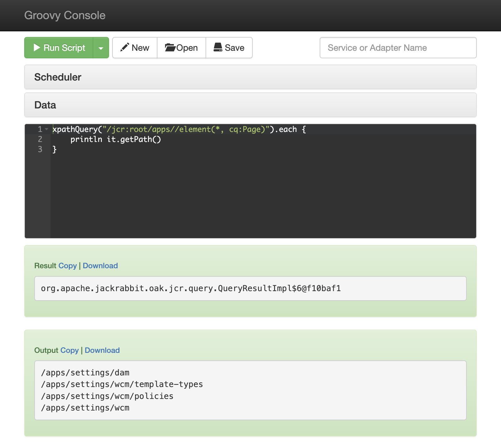

[](https://search.maven.org/artifact/be.orbinson.aem/aem-groovy-console-all)
[](https://github.com/orbinson/aem-groovy-console/releases)
[](https://github.com/orbinson/aem-groovy-console/actions/workflows/build-on-prem.yml)
[](https://github.com/orbinson/aem-groovy-console/actions/workflows/build-cloud.yml)

# AEM Groovy Console

## Overview

The AEM Groovy Console provides an interface for running [Groovy](https://www.groovy-lang.org) scripts in Adobe
Experience Manager. Scripts can be created to manipulate content in the JCR, call OSGi services, or execute arbitrary
code using the AEM, Sling, or JCR APIs. After installing the package in AEM (instructions below), see
the [console page](http://localhost:4502/groovyconsole) for documentation on the available bindings and methods. Sample
scripts are included in the package for reference.



## Compatibility

Supported versions:

* AEM On premise: `>= 6.5.10`
* AEM as a Cloud Service: `>= 2022.11`
* Sling: `>=12`

Embedded Groovy version: `2.4.15`

To install the AEM Groovy Console on older AEM versions check the original
project [aem-groovy-console](https://github.com/CID15/aem-groovy-console)

## Installation

### Manual

1. Download the
   console [aem-groovy-console-all](https://github.com/orbinson/aem-groovy-console/releases/download/18.0.0/aem-groovy-console-all-18.0.0.zip)
   content package and install with [PackMgr](http://localhost:4502/crx/packmgr). For previous versions you can search
   on the [Maven Central repository](https://search.maven.org/search?q=a:aem-groovy-console).

2. Navigate to the [groovyconsole](http://localhost:4502/groovyconsole) page.

### Maven profiles

Maven profiles can be used to install the bundles to AEM / Sling

* AEM Author running on localhost:4502
  * api & bundle: `-P autoInstallBundle`
  * ui.apps, ui.apps.aem, ui.config, ui.content: `-P autoInstallPackage`
  * all: `-P autoInstallSinglePackage`
* AEM Publish running on localhost:4503
  * api & bundle: `-P autoInstallBundle,publish`
  * ui.apps, ui.apps.aem, ui.config, ui.content: `-P autoInstallPackage,publish`
  * all: `-P autoInstallSinglePackage,publish`
* Sling running on localhost:8080
  * api & bundle: `-P autoInstallBundle,sling`
  * ui.apps, ui.apps.aem, ui.config, ui.content: `-P autoInstallPackage,sling`
  * all: `-P autoInstallSingleSling`

### Embedded package

To deploy the Groovy Console as an embedded package you need to update your `pom.xml`

1. Add the `aem-groovy-console-all` to the `<dependencies>` section

   ```xml
   <dependency>
     <groupId>be.orbinson.aem</groupId>
     <artifactId>aem-groovy-console-all</artifactId>
     <version>18.0.0</version>
     <type>zip</type>
   </dependency>
   ```
2. Embed the package in with
   the [filevault-package-maven-plugin](https://jackrabbit.apache.org/filevault-package-maven-plugin/) in
   the `<embeddeds>` section

   ```xml
   <embedded>
      <groupId>be.orbinson.aem</groupId>
      <artifactId>aem-groovy-console-all</artifactId>
      <target>/apps/vendor-packages/content/install</target>
   </embedded>
   ```

### AEM Dispatcher

If you need to have the Groovy Console available through the dispatcher on a publish instance you can add the filters
following configuration.

```text
# Allow Groovy Console page
/001 {
    /type "allow"
    /url "/groovyconsole"
}
/002 {
    /type "allow"
    /url "/apps/groovyconsole.html"
}

# Allow servlets
/003 {
    /type "allow"
    /path "/bin/groovyconsole/*"
}
```

## Building From Source

To build and install the latest development version of the Groovy Console to use in AEM (or if you've made source modifications), run
the following Maven command.

```shell
mvn clean install -P autoInstallSinglePackage
```

## OSGi Configuration

To check the OSGi configuration navigate to
the [Groovy Console Configuration Service](http://localhost:4502/system/console/configMgr/be.orbinson.aem.groovy.console.configuration.impl.DefaultConfigurationService)
OSGi configuration page.

| Property                        | Description                                                                                                                       | Default Value |
|---------------------------------|-----------------------------------------------------------------------------------------------------------------------------------|---------------|
| Email Enabled?                  | Check to enable email notification on completion of script execution.                                                             | `false`       |
| Email Recipients                | Email addresses to receive notification.                                                                                          | `[]`          |
| Script Execution Allowed Groups | List of group names that are authorized to use the console.  By default, only the 'admin' user has permission to execute scripts. | `[]`          |
| Scheduled Jobs Allowed Groups   | List of group names that are authorized to schedule jobs.  By default, only the 'admin' user has permission to schedule jobs.     | `[]`          |
| Audit Disabled?                 | Disables auditing of script execution history.                                                                                    | `false`       |
| Display All Audit Records?      | If enabled, all audit records (including records for other users) will be displayed in the console history.                       | `false`       |
| Thread Timeout                  | Time in seconds that scripts are allowed to execute before being interrupted.  If 0, no timeout is enforced.                      | 0             |
| Distributed execution enabled?  | If enabled, a script will be able to be replicated from an author and executed on all default replication agents.                 | `false`       |

## Batch script execution

Saved scripts can be remotely executed by sending a POST request to the console servlet with either the `scriptPath`
or `scriptPaths` query parameter.

### Single script

```shell
curl -d "scriptPath=/conf/groovyconsole/scripts/samples/JcrSearch.groovy" -X POST -u admin:admin http://localhost:4502/bin/groovyconsole/post.json
```

### Multiple scripts

```shell
curl -d "scriptPaths=/conf/groovyconsole/scripts/samples/JcrSearch.groovy&scriptPaths=/conf/groovyconsole/scripts/samples/FulltextQuery.groovy" -X POST -u admin:admin http://localhost:4502/bin/groovyconsole/post.json
```

## Extensions

The Groovy Console provides extension hooks to further customize script execution. The console provides an API
containing extension provider interfaces that can be implemented as OSGi services in any bundle deployed to an AEM
instance. See the default extension providers in the `be.orbinson.aem.groovy.console.extension.impl` package for
examples of how a bundle can implement these services to supply additional script bindings, compilation customizers,
metaclasses, and star imports.

| Service Interface                                                           | Description                                                                                                                  |
|-----------------------------------------------------------------------------|------------------------------------------------------------------------------------------------------------------------------|
| `be.orbinson.aem.groovy.console.api.BindingExtensionProvider`               | Customize the bindings that are provided for each script execution.                                                          |
| `be.orbinson.aem.groovy.console.api.CompilationCustomizerExtensionProvider` | Restrict language features (via blacklist or whitelist) or provide AST transformations within the Groovy script compilation. |
| `be.orbinson.aem.groovy.console.api.ScriptMetaClassExtensionProvider`       | Add runtime metaclasses (i.e. new methods) to the underlying script class.                                                   |
| `be.orbinson.aem.groovy.console.api.StarImportExtensionProvider`            | Supply additional star imports that are added to the compiler configuration for each script execution.                       |

## Registering Additional Metaclasses

Services implementing the `be.orbinson.aem.groovy.console.extension.MetaClassExtensionProvider` will be automatically discovered and bound by the OSGi container. These services can be implemented in any deployed bundle. The AEM Groovy Extension bundle will handle the registration and removal of supplied metaclasses as these services are activated/deactivated in the container. See the `DefaultMetaClassExtensionProvider` service for the proper closure syntax for registering metaclasses.

## Notifications

To provide custom notifications for script executions, bundles may implement
the `be.orbinson.aem.groovy.console.notification.NotificationService` interface (see
the `be.orbinson.aem.groovy.console.notification.impl.EmailNotificationService` class for an example). These services
will
be dynamically bound by the Groovy Console service and all registered notification services will be called for each
script execution.

## Scheduler

The Scheduler allows for immediate (asynchronous) or Cron-based script execution. Scripts are executed
as [Sling Jobs](https://sling.apache.org/documentation/bundles/apache-sling-eventing-and-job-handling.html) and are
audited in the same manner as scripts executed in the console.

### Scheduled Job Event Handling

Bundles may implement services
extending `be.orbinson.aem.groovy.console.job.event.AbstractGroovyConsoleScheduledJobEventHandler` to provide
additional post-processing or notifications for completed Groovy Console jobs.
See `be.orbinson.aem.groovy.console.job.event.DefaultGroovyConsoleEmailNotificationEventHandler` for an example of the
required annotations to register a custom event handler.

## Sample Scripts

Sample scripts can be found in the [samples](src/main/content/jcr_root/conf/groovyconsole/scripts/samples) directory.

## Kudos

Kudos to [ICF Next](https://github.com/icfnext/aem-groovy-console)
and [CID 15](https://github.com/CID15/aem-groovy-console) for the initial development of the AEM Groovy Console. We
forked this plugin because the maintenance of the plugins seems to have stopped.
