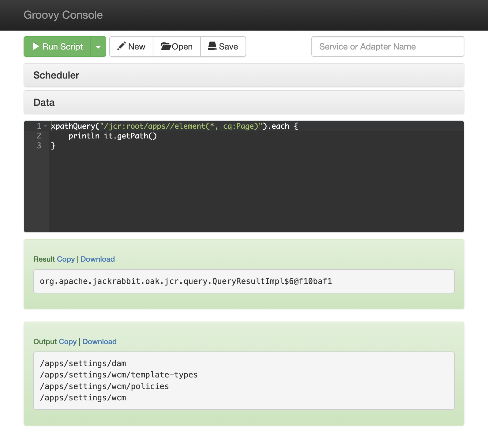

[](https://search.maven.org/artifact/be.orbinson.aem/aem-groovy-console-all)
[](https://github.com/orbinson/aem-groovy-console/releases)
[](https://github.com/orbinson/aem-groovy-console/actions/workflows/build.yml)
[](https://plugins.jetbrains.com/plugin/9269-aem-ide)


# AEM Groovy Console

> [!IMPORTANT]
> Currently Adobe Managed Services is not allowing AEM Groovy Console to be installed on production publish environments for security reasons. We are taking actions in order to get it accepted.

## Overview

The AEM Groovy Console provides an interface for running [Groovy](https://www.groovy-lang.org) scripts in Adobe
Experience Manager. Scripts can be created to manipulate content in the JCR, call OSGi services, or execute arbitrary
code using the AEM, Sling, or JCR APIs. After installing the package in AEM (instructions below), see
the [console page](http://localhost:4502/groovyconsole) for documentation on the available bindings and methods. A
complete reference of all default [bindings and methods](docs/bindings.md) is also available. Sample scripts are included
in the package for reference.

The console ships with two UIs:

* a **modern UI** (the default) — an IDE-style interface built with [Spectrum Web Components](https://opensource.adobe.com/spectrum-web-components/)
  and the [Monaco Editor](https://microsoft.github.io/monaco-editor/), featuring code completion, live compile
  diagnostics and streaming output. It has no dependency on AEM Granite/Coral UI and runs on both AEM and plain Sling.
* the **classic UI** — the original Bootstrap interface, still available and fully supported.

`/groovyconsole` serves whichever UI is configured as the [default](#osgi-configuration); both are always reachable
directly via the `.modern.html` / `.classic.html` selectors. See [Modern UI](#modern-ui) for details.



## Compatibility

AEM Groovy Console 20.x requires **Java 11, 17 or 21** with an embedded Groovy version of 5.x (currently 5.0.6),
and adds the modern UI, streaming execution, code assistance and the reports extension.

Projects still on Java 8, or that need to stay on Groovy 4.x — for example to run this migration extension
alongside AECU during a transition, see [Migrating from AECU](#migrating-from-aecu) below — should use the 19.x
line instead: it's the maintenance line, and embeds Groovy 4.x.

Supported versions:

* AEM 6.5 On premise: `>= 6.5.10`
* AEM 6.5 LTS On premise: `>= 6.5 LTS or 6.6.0 quickstart`
* AEM as a Cloud Service: `>= 2022.11`
* Sling: `>=12`

To install the AEM Groovy Console on older AEM versions check the original
project [aem-groovy-console](https://github.com/CID15/aem-groovy-console)

## Installation

### Manual

1. Download the
   console [aem-groovy-console-all](https://github.com/orbinson/aem-groovy-console/releases/download/19.0.3/aem-groovy-console-all-19.0.3.zip)
   content package and install with [PackMgr](http://localhost:4502/crx/packmgr). For previous versions you can search
   on the [Maven Central repository](https://search.maven.org/search?q=a:aem-groovy-console).

2. Navigate to the [groovyconsole](http://localhost:4502/groovyconsole) page.

### Maven profiles

Maven profiles can be used to install the bundles to AEM / Sling

* AEM Author running on localhost:4502
    * api, bundle, ui.apps, ui.apps.aem, ui.config, ui.content: `-P auto-deploy`
    * all: `-P auto-deploy-single-package,aem`
* AEM Publish running on localhost:4503
    * api, bundle, ui.apps, ui.apps.aem, ui.config, ui.content: `-P auto-deploy,publish`
    * all: `-P auto-deploy-single-package,aem,publish`
* Sling running on localhost:8080
    * api, bundle, ui.apps, ui.apps.aem, ui.config, ui.content: `-P auto-deploy,sling`
    * all: `-P auto-deploy-single-package,sling`

### Embedded package

To deploy the Groovy Console as an embedded package you need to update your `pom.xml`

1. Add the `aem-groovy-console-all` to the `<dependencies>` section

   ```xml
   <dependency>
     <groupId>be.orbinson.aem</groupId>
     <artifactId>aem-groovy-console-all</artifactId>
     <version>19.0.8</version>
     <type>zip</type>
   </dependency>
   ```
2. Embed the package in with
   the [filevault-package-maven-plugin](https://jackrabbit.apache.org/filevault-package-maven-plugin/) in
   the `<embeddeds>` section

   ```xml
   <embedded>
      <groupId>be.orbinson.aem</groupId>
      <artifactId>aem-groovy-console-all</artifactId>
      <target>/apps/vendor-packages/content/install</target>
   </embedded>
   ```

### AEM Dispatcher

If you need to have the Groovy Console available through the dispatcher on a publish instance you can add the filters
following configuration.

```text
# Allow Groovy Console page
/001 {
    /type "allow"
    /url "/groovyconsole"
}
/002 {
    /type "allow"
    /url "/apps/groovyconsole.html"
}

# Allow servlets
/003 {
    /type "allow"
    /path "/bin/groovyconsole/*"
}
```

## Building From Source

To build and install the latest development version of the Groovy Console to use in AEM (or if you've made source
modifications), run
the following Maven command.

```shell
mvn clean install -P autoInstallSinglePackage
```

The build is self-contained: the `ui.frontend` module downloads a pinned Node.js version and builds the modern UI
into the `ui.apps` content package automatically.

## Modern UI

The modern UI is an IDE-style interface built
with [Spectrum Web Components](https://opensource.adobe.com/spectrum-web-components/) and
the [Monaco Editor](https://microsoft.github.io/monaco-editor/) (the editor that powers VS Code). It has no
dependency on AEM Granite/Coral UI and runs on both AEM and plain Sling.

Routing:

* `/groovyconsole` serves the UI selected by the **Default UI** OSGi property (`modern` by default)
* `/apps/groovyconsole.modern.html` always serves the modern UI
* `/apps/groovyconsole.classic.html` always serves the classic UI
* the classic UI has a "Try the new UI" link; the modern UI links back from its Help panel

Layout — a resizable split between a hero editor and an output dock, an activity rail opening slide-out drawers for
**History**, **Scheduled Jobs** and **Help/Reference**, and a status bar showing run state, Groovy version and the
keyboard shortcuts. The output dock has tabs for **Log** (selected by default), **Result**, **Table** and **Trace**.

Developer-experience features:

* IDE-like completions backed by the `/bin/groovyconsole/assist/*` endpoints: classes visible to the script
  classloader (with auto-import), methods and properties after a dot (including Groovy metaclass/GDK methods),
  script bindings, OSGi service names inside `getService("...")`, and snippets
* On-the-fly compile diagnostics: scripts are compiled (never executed) server-side with the same compiler
  configuration as script execution, and errors appear as markers in the editor
* [Streaming output](#streaming-script-execution): script output appears live in the dock while the script runs
* Clickable stack-trace frames that jump to the offending line in the editor
* Folder-navigable Open/Save script dialogs that also work on plain Sling (the classic UI's dialogs were AEM-only)
* Light/dark Spectrum theme synced with the editor; `Ctrl/Cmd+Enter` to run, `Ctrl/Cmd+S` to save, `Ctrl/Cmd+K` for
  the editor command palette

### Frontend development

The modern UI lives in `ui.frontend` (Lit + TypeScript + Vite). For local development with hot reload against a
running AEM or Sling instance:

```shell
cd ui.frontend
npm install
GC_PROXY_TARGET=http://localhost:4502 npm run dev # default proxy target is http://localhost:8080
```

### End-to-end tests

Playwright tests for the modern UI live in `ui.tests`. The `ui-tests` Maven profile boots a Sling feature-model
instance with the Groovy Console installed, runs the tests against it, and shuts it down again:

```shell
mvn verify -P ui-tests -pl ui.tests
```

To run the tests against an already-running AEM or Sling instance instead:

```shell
cd ui.tests
npm install
GC_BASE_URL=http://localhost:4502 npx playwright test
```

### Run a local instance

To launch a standalone Sling instance with the console installed — the same aggregated feature model the integration
tests use — for manual testing:

```shell
mvn clean install                  # build the current SNAPSHOT artifacts
mvn verify -Prun -pl it.tests      # boot Sling on http://localhost:8080 (admin/admin)
```

The instance runs in the foreground and tails its log; press `Ctrl+C` to stop it. Override the port
with `-Dhttp.port=xxxx`.

## OSGi Configuration

To check the OSGi configuration navigate to
the [Groovy Console Configuration Service](http://localhost:4502/system/console/configMgr/be.orbinson.aem.groovy.console.configuration.impl.DefaultConfigurationService)
OSGi configuration page.

| Property                        | Description                                                                                                                       | Default Value |
|---------------------------------|-----------------------------------------------------------------------------------------------------------------------------------|---------------|
| Email Enabled?                  | Check to enable email notification on completion of script execution.                                                             | `false`       |
| Email Recipients                | Email addresses to receive notification.                                                                                          | `[]`          |
| Script Execution Allowed Groups | List of group names that are authorized to use the console.  By default, only the 'admin' user has permission to execute scripts. | `[]`          |
| Scheduled Jobs Allowed Groups   | List of group names that are authorized to schedule jobs.  By default, only the 'admin' user has permission to schedule jobs.     | `[]`          |
| Audit Disabled?                 | Disables auditing of script execution history.                                                                                    | `false`       |
| Display All Audit Records?      | If enabled, all audit records (including records for other users) will be displayed in the console history.                       | `false`       |
| Thread Timeout                  | Time in seconds that scripts are allowed to execute before being interrupted.  If 0, no timeout is enforced.                      | 0             |
| Distributed execution enabled?  | If enabled, scripts saved under `/conf/groovyconsole/replication/` and replicated from author will be automatically executed on publish/preview instances. See [Distributed Execution](#distributed-execution-aemaacs-publishpreview). | `false`       |
| Default UI                      | Which console UI (`modern` or `classic`) the `/groovyconsole` path resolves to. The other is always reachable via the `.modern.html` / `.classic.html` selector. See [Modern UI](#modern-ui). | `modern`      |

## Distributed Execution (AEMaaCS Publish/Preview)

In AEM as a Cloud Service, publish and preview instances cannot be accessed individually. To execute write operations on
publish/preview, the Groovy Console supports **distributed execution**: scripts are replicated from author and
automatically executed on all publish instances.

### How it works

1. Enable **Distributed execution enabled?** in
   the [OSGi configuration](http://localhost:4502/system/console/configMgr/be.orbinson.aem.groovy.console.configuration.impl.DefaultConfigurationService)
   on **both author and publish/preview**.
2. Write your script in the console on **author**.
3. Click the dropdown arrow next to the **Run Script** button and select **"Run script on all publish instances"**.
4. The console automatically saves the script to `/conf/groovyconsole/replication/`, replicates it to all publish
   instances, and the `ReplicatedScriptListener` on each publish instance executes it upon arrival.


## Streaming script execution

Scripts can be executed asynchronously so that their output can be read while they are still running. This also
avoids gateway timeouts for long-running scripts on AEM as a Cloud Service, where synchronous requests are cut off
after about a minute.

1. Start the execution with the additional `async=true` parameter:

   ```shell
   curl -u admin:admin -d "script=..." -d "async=true" -X POST http://localhost:4502/bin/groovyconsole/post.json
   # → {"executionId":"<uuid>"}
   ```

2. Poll for output until `done` is `true` (pass back the returned `offset` to only receive new output):

   ```shell
   curl -u admin:admin "http://localhost:4502/bin/groovyconsole/stream.json?executionId=<uuid>&offset=0"
   # → {"chunk":"...","offset":42,"done":false}
   # → {"chunk":"...","offset":97,"done":true,"response":{ ...full run response... }}
   ```

Both console UIs use this transparently; audit records are created exactly as for synchronous executions, and
without the `async` parameter the endpoint behaves exactly as before (existing integrations are unaffected).

> [!NOTE]
> Execution state is held in memory on the instance that started the script and is retained for ten minutes after
> completion. On clustered authors (AEM as a Cloud Service) polling relies on session affinity; if a poll is routed
> to another instance the live output is unavailable, but the script keeps running and its result is still audited.

## Batch script execution

Saved scripts can be remotely executed by sending a POST request to the console servlet with either the `scriptPath`
or `scriptPaths` query parameter.

### Single script

```shell
curl -d "scriptPath=/conf/groovyconsole/scripts/samples/JcrSearch.groovy" -X POST -u admin:admin http://localhost:4502/bin/groovyconsole/post.json
```

### Multiple scripts

```shell
curl -d "scriptPaths=/conf/groovyconsole/scripts/samples/JcrSearch.groovy&scriptPaths=/conf/groovyconsole/scripts/samples/FulltextQuery.groovy" -X POST -u admin:admin http://localhost:4502/bin/groovyconsole/post.json
```

## Extensions

The Groovy Console provides extension hooks to further customize script execution. The console provides an API
containing extension provider interfaces that can be implemented as OSGi services in any bundle deployed to an AEM
instance. See the default extension providers in the `be.orbinson.aem.groovy.console.extension.impl` package for
examples of how a bundle can implement these services to supply additional script bindings, compilation customizers,
metaclasses, and star imports.

| Service Interface                                                           | Description                                                                                                                  |
|-----------------------------------------------------------------------------|------------------------------------------------------------------------------------------------------------------------------|
| `be.orbinson.aem.groovy.console.api.BindingExtensionProvider`               | Customize the bindings that are provided for each script execution.                                                          |
| `be.orbinson.aem.groovy.console.api.CompilationCustomizerExtensionProvider` | Restrict language features (via blacklist or whitelist) or provide AST transformations within the Groovy script compilation. |
| `be.orbinson.aem.groovy.console.api.ScriptMetaClassExtensionProvider`       | Add runtime metaclasses (i.e. new methods) to the underlying script class.                                                   |
| `be.orbinson.aem.groovy.console.api.StarImportExtensionProvider`            | Supply additional star imports that are added to the compiler configuration for each script execution.                       |

## Extension Packages

Beyond the per-script extension hooks above, larger opt-in features live in the `extensions/` directory as
**separate Maven modules that ship as their own content packages** — they are *not* embedded in the console's
`all` package.

The philosophy is to keep the core console small and focused: a tool for running Groovy scripts. Not every
installation wants every feature, so anything that is a self-contained capability rather than part of the core
is factored out into its own extension package. This keeps the base install lean, lets teams deploy (and audit,
and reason about) exactly the surface area they need, and means an extension can evolve — or eventually move to
its own repository — without touching the console itself.

Two rules make this work:

* **The console has no dependency on any extension.** It is fully functional with zero extensions installed;
  removing an extension's package removes its code paths entirely.
* **Extensions integrate only through the console's public APIs** — the script-execution SPIs listed above, plus
  the `be.orbinson.aem.groovy.console.api.ConsoleUiExtensionProvider` SPI, which lets an extension contribute
  panels to the modern UI's activity rail. The console announces the registered module URLs to its SPA, which
  loads them dynamically and exposes a small registration API (`window.GroovyConsole.registerPanel(...)`).
  Extensions interact with the shell only through this API and DOM events, never through compile-time coupling.

To use an extension, install the console first, then deploy the extension's content package.

Available extensions:

| Extension                | Package                            | Description                                          |
|--------------------------|------------------------------------|------------------------------------------------------|
| [Reports](#reports)      | `aem-groovy-console-reports-all`   | Business-facing reports backed by Groovy scripts     |
| [Migration](#migration)  | `aem-groovy-console-migration-all` | Run-once deployment migration scripts (AECU replacement) |

### Reports

The `extensions/reports/` modules provide an **optional** business-facing reporting extension. It ships as its
own content package, `aem-groovy-console-reports-all`, installed **separately on top of the console** (install the
console first) — via [PackMgr](http://localhost:4502/crx/packmgr) or Maven, the same way as the console. The
console works fine without it; installing it adds the reports feature.

Authors write a Groovy script that returns tabular data (`report.data()` with typed
`STRING`/`NUMBER`/`DATE`/`BOOLEAN`/`LINK` columns); business users run it from a parameter form, page through and
export the persisted result, and browse past runs. Access is governed entirely by JCR permissions on
`/conf/groovyconsole/reports` (read = view/run, write = create/edit/delete). It contributes a business UI at
`/apps/groovyconsole/reports.html` and a Reports drawer in the modern console.

See **[`extensions/reports/README.md`](extensions/reports/README.md)** for the full documentation — installation,
parameters, column types, the execution model, exports (CSV/XLSX) and configuration.

### Migration

The `extensions/migration/` modules provide an **optional** deployment migration extension replacing the deprecated
[AEM Easy Content Upgrade (AECU)](https://github.com/valtech/aem-easy-content-upgrade) project. It ships as its own
content package, `aem-groovy-console-migration-all`, installed **separately on top of the console** (install the
console first). The console works fine without it; installing it adds the migration feature.

Groovy migration scripts are deployed via content package below `/conf/groovyconsole/scripts/migration` and
executed with **checksum-based run-once semantics**: a script runs when it is new, its content changed or its last
execution was not successful. Scripts execute in deterministic alphanumeric path order with fail-fast behavior.
Runs are triggered over HTTP (`POST /bin/groovyconsole/migration`, sync or async — ideal for CI/CD pipelines), by
an opt-in resource listener reacting to script deployments, or from the UI: a migration history page at
`/apps/groovyconsole/migrations.html` (also linked from the AEM Tools console) and a Migrations drawer in the
modern console.

See **[`extensions/migration/README.md`](extensions/migration/README.md)** for the full documentation — script
conventions (`.always.groovy`, `author`/`publish` run-mode tokens), the HTTP API and configuration.

#### Migrating from AECU

If you need to run AECU and this migration extension **on the same AEM instance** during a transition — e.g.
moving scripts over gradually instead of in one cutover — start on **19.2.0**: AECU hard-depends on Groovy 4.x,
so it cannot coexist with the 20.x line's Groovy 5.x runtime. Once every script has moved over and AECU is
uninstalled, you can upgrade to the 20.x line in a second phase to pick up the modern UI, streaming execution,
code assistance and the reports extension.

## Registering Additional Metaclasses

Services implementing the `be.orbinson.aem.groovy.console.extension.MetaClassExtensionProvider` will be automatically
discovered and bound by the OSGi container. These services can be implemented in any deployed bundle. The AEM Groovy
Extension bundle will handle the registration and removal of supplied metaclasses as these services are
activated/deactivated in the container. See the `DefaultMetaClassExtensionProvider` service for the proper closure
syntax for registering metaclasses.

## Notifications

To provide custom notifications for script executions, bundles may implement
the `be.orbinson.aem.groovy.console.notification.NotificationService` interface (see
the `be.orbinson.aem.groovy.console.notification.impl.EmailNotificationService` class for an example). These services
will
be dynamically bound by the Groovy Console service and all registered notification services will be called for each
script execution.

## Scheduler

The Scheduler allows for immediate (asynchronous) or Cron-based script execution. Scripts are executed
as [Sling Jobs](https://sling.apache.org/documentation/bundles/apache-sling-eventing-and-job-handling.html) and are
audited in the same manner as scripts executed in the console.

### Scheduled Job Event Handling

Bundles may implement services
extending `be.orbinson.aem.groovy.console.job.event.AbstractGroovyConsoleScheduledJobEventHandler` to provide
additional post-processing or notifications for completed Groovy Console jobs.
See `be.orbinson.aem.groovy.console.job.event.DefaultGroovyConsoleEmailNotificationEventHandler` for an example of the
required annotations to register a custom event handler.

## Sample Scripts

Sample scripts can be found in the [samples](ui.content/src/main/content/jcr_root/conf/groovyconsole/scripts/samples) directory.

## Kudos

Kudos to [ICF Next](https://github.com/icfnext/aem-groovy-console)
and [CID 15](https://github.com/CID15/aem-groovy-console) for the initial development of the AEM Groovy Console. We
forked this plugin because the maintenance of the plugins seems to have stopped.
